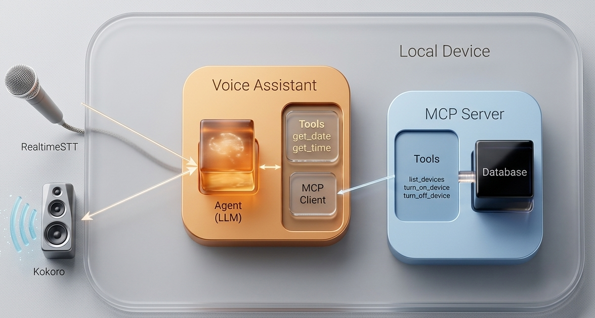

# Localis
A fully local, privacy-first voice assistant that runs entirely on personal hardware, designed to replicate and eventually surpass smart assistant functionality without cloud dependencies or subscription costs.

### Why we are here?
I want an Amazon Alexa, but I don't have enough money to buy it😂.
Given the rise of LLM Agents and MCP servers, it's become easier that ever to crease 
personal assistants and chatbots. And then I ask myself.

`"Why stop at a chatbot? Why not take this one step further and create my own voice assistant?"`

Also I have started learning agentic-ai a few days ago with a background experience in 
LLM and Multi-modal system. So this is my attempt to do just that.

### Goals
So I think, what exactly do I want my voice assistant to be able to do?
This is my list of initial goals:
1. **Run on my local computer**
I don’t want to pay for a subscription to use an LLM, and in fact, I don’t want to pay for anything.

Everything I build should just run on my local computer without having to worry about costs or how much free credit I have left at the end of each month.
2. **Replicate Alexa functionality**
Let’s take baby steps - first I simply want to replicate the functionality that Alexa already have. This will be a good milestone to work towards, before I add more complex, extravagant features.

It should be able to:

- Get the current date or time.
- Get weather information for today.
- News updates.
- Web-search capability.

before I start building this out into a fully-fledged Tony Stark’s Jarvis-esque voice assistant that can compute how to travel back in time.

3. **Be Quick**
If the responses aren’t fast enough, the voice assistant is as good as being silent.

Asking a question and waiting over a minute for a response is unacceptable. I want to be able to ask a question and get a response in a reasonable amount of time.

However, I’m not going to expect millisecond-level response times. Instead the response times should be quicker than the time it takes me to execute the task/query myself. At least in this way I know that I’m saving time.

In future, I’ll delve deeper into the optimisations I do to get this down to millisecond response times without paying for subscriptions.

## Overall Structure
The project structure as follows
 

## Project Stucture:
localis/
│
├── .venv/
├── .python-version
├── .env                          # API keys, config secrets (gitignored)
├── .gitignore
├── pyproject.toml
├── README.md
│
├── main.py                       # Entry point — boots everything up
│
├── config/
│   ├── __init__.py
│   └── settings.py               # Central config (wake word, model names, ports, etc.)
│
├── voice/
│   ├── __init__.py
│   ├── listener.py               # RealtimeSTT, VAD, wake word detection
│   ├── speaker.py                # Kokoro TTS, audio streaming to speaker
│   └── utils.py                  # Audio helpers (resampling, format conversion)
│
├── agent/
│   ├── __init__.py
│   ├── graph.py                  # LangGraph workflow definition
│   ├── state.py                  # AgentState dataclass
│   ├── llm.py                    # Ollama LLM initialisation
│   └── tools/
│       ├── __init__.py
│       ├── datetime_tool.py
│       ├── weather_tool.py
│       └── search_tool.py
│
├── mcp_server/
│   ├── __init__.py
│   ├── server.py                 # MCP server entry point
│   ├── database.py               # SQLite device registry (CRUD)
│   └── tools/
│       ├── __init__.py
│       ├── find_device.py        # Tool: look up device connection info
│       └── control_device.py    # Tool: turn device on/off
│
└── data/
    └── devices.db                # SQLite DB (gitignored)
----

### Voice Assistant
1. **Speech-to-Text and Text-to-Speech**
I make use of RealtimeSTT for wake word detection (e.g. “Alexa”, “Hey Jarvis”, “Hey Siri”), speech detection and real-time speech-to-text transcription.

The transcribed text is then sent to the Agent for processing, after which its response is then streamed to a Kokoro text-to-speech model. The output is then sent to the speaker.

2. **Agent**
I will use `ollama` to run LLMs locally. The agent and the workflow that it takes
is implemented in `LangGraph`.

The agent is responsible for taking a user query, understand it, and call on the tools
it thinks are required to provide and appropriate response.

Our voice assistant will require the following tools to meets our goals:
- A tool to get the current date and time
- A tool to get the current weather update
- A tool to be able to search on web

It also needs tools to interact with smart-home devices, but the implementation for this can get quite involved so we implement this in a separate MCP server.

3. **MCP Server for smart-home Connection**
The MCP server is where we encapsulate the complexity of finding, connecting to, and managing the devices.

A SQL database keeps track of devices, their connection information and their names.

Meanwhile, tools are the interface through which an agent finds the connection information for a given device, and then uses it to turn the device on or off.

### Text-to-Speech Implementation
So for this part, given some string we assume comes from the agent, 
pass it through a pre-trained text-to-speech model and stream it to the device speaker.

Here for now I will use an text to speech model. Now we are using Kokoro model cause it 
is light weight and fast. But in future I want to try out other models so I created a 
base class for speaker so that futher we can just implement child class with other models
inside `speaker.py` and then I am good to go.😊

### Tools Implementation

### Speech-to-text Implementation
Speech-to-text (STT) is one of the more complicated parts of building a voice assistant 
because it involves continuous realtime audio processing.

The actual transcription step is relatively straightforward now thanks to modern 
open-source models like Whisper. The difficult part is building the surrounding realtime system:
- continuously listening to microphone input
- detecting when the user starts speaking
- handling silence detection
- detecting a wake word such as:
   - “Hey Google”
   - “Hey Siri”
   - “Alexa”
- streaming audio chunks efficiently.
- keeping latency low enough for natural interaction

Initially, I explored using the RealtimeSTT package from RealtimeSTT GitHub Repository 
because it already implements a lot of this realtime infrastructure. However, the setup 
introduced a fair amount of additional complexity around multiprocessing, dependencies, 
and Windows audio handling.

For now, I decided to keep the implementation simpler and more transparent by directly using a lightweight Whisper model from Hugging Face Transformers together with sounddevice.

The current pipeline works like this:

1. Record audio directly from the microphone
2. Convert the recorded audio into a NumPy array
3. Pass the audio array into a Whisper-based ASR pipeline
4. Receive the transcribed text output

The implementation currently uses:
- sounddevice for realtime microphone recording
- transformers.pipeline() for automatic speech recognition
- `distil-whisper/distil-small.en` as the speech recognition model
- CUDA acceleration through PyTorch for faster inference

This keeps the architecture lightweight and much easier to debug while still providing good transcription quality for a local voice assistant.

